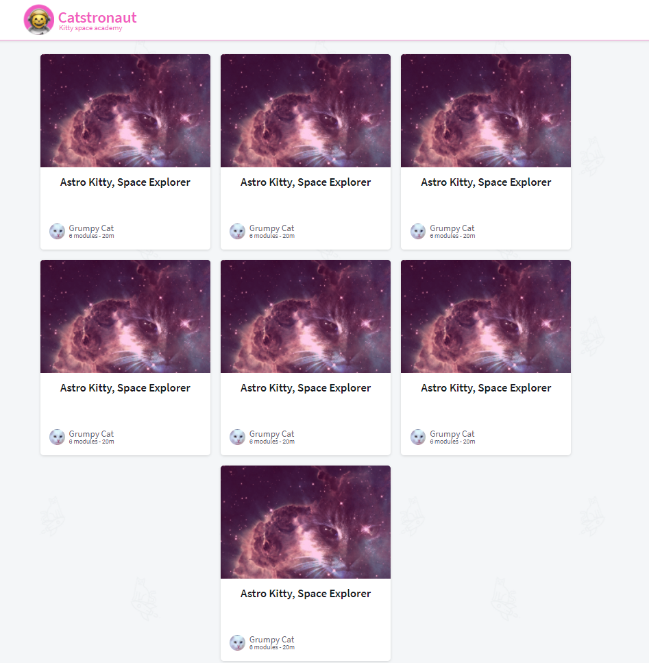
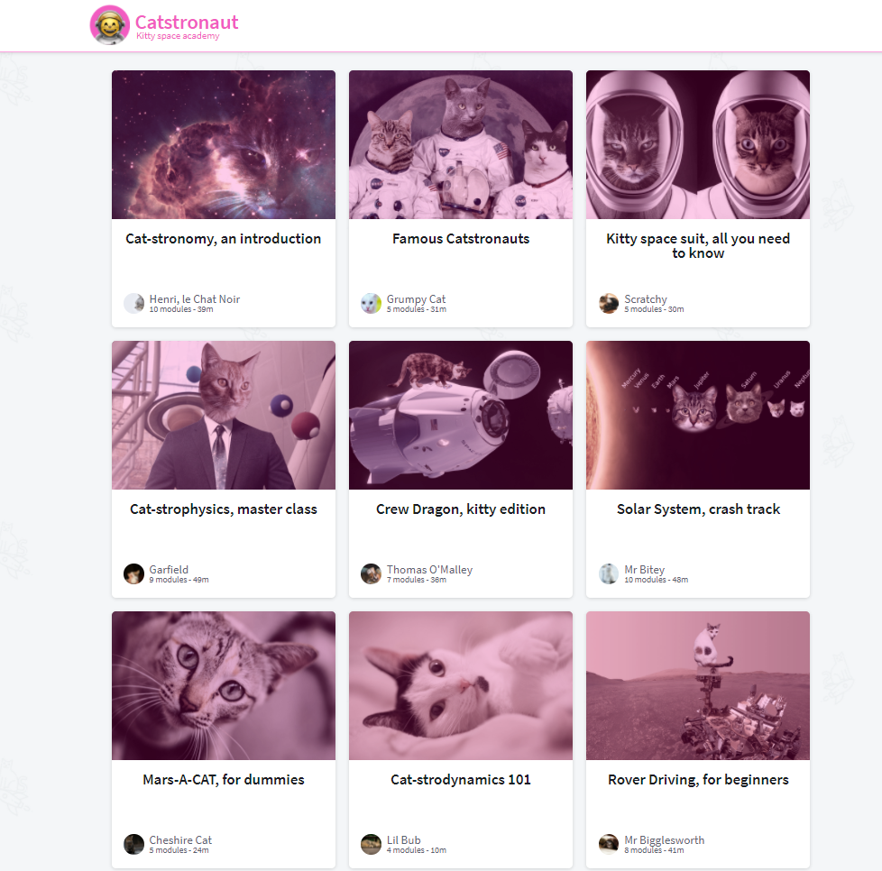

# Apollo Odyssey tutorial Repository

This Repository is [Apollo Client Organization](https://github.com/apollographql)'s tutorial

- Thanks for useful tutorial 😄

## Part1 🔥

[Origin Repository](https://github.com/apollographql/odyssey-lift-off-part1)

### Goal

- Setup apollo server and client
- Building schema
- Apollo server response with mock data
- Handling datas from server with useQuery hook
- Render datas

### Result

## Part2 🔥

[Origin Repository](https://github.com/apollographql/odyssey-lift-off-part2)

### Goal

- Setup RESTDataSource
- build resolvers with RESTDataSource
- What is Advantages of RESTDataSource

### Result

